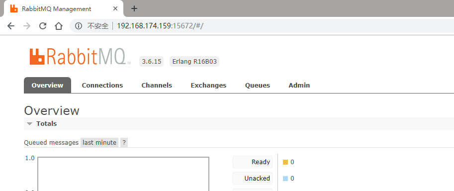

<!-- toc orderedList:0 depthFrom:1 depthTo:6 -->
* [RabbitMQ简介](#RabbitMQ简介)
    * [技术亮点](#技术亮点)
* [AMQP协议简介](#AMQP协议简介)
* [安装rabbitmq](#安装rabbitmq)
    * [安装](#安装)
    * [远程访问配置](#远程访问配置)
    * [账户操作](#账户操作)
    * [其他操作](#其他操作)
* [代码实例](#代码实例)
    * [单线程队列模式](#单线程队列模式)
    * [多线程队列模式](#多线程队列模式)
    * [发布/订阅模式](#发布/订阅模式)
    * [路由模式(直连交换机模式)](#路由模式(直连交换机模式))
    * [主题交换机模式](#主题交换机模式)
    * [远程调用模式](#远程调用模式)
<!-- tocstop -->

# RabbitMQ简介
消息系统允许软件、应用相互连接和扩展．这些应用可以相互链接起来组成一个更大的应用，或者将用户设备和数据进行连接．消息系统通过将消息的发送和接收分离来实现应用程序的异步和解偶．

数据投递、非阻塞操作或推送通知、实现发布／订阅、异步处理、作队列。所有这些都可以通过消息系统实现。

RabbitMQ是一个基于AMQP原理的消息代理 - 一个消息系统的媒介。它可以为你的应用提供一个通用的消息发送和接收平台，并且保证消息在传输过程中的安全。

## 技术亮点
- 可靠性

RabbitMQ提供了多种技术可以让你在性能和可靠性之间进行权衡。这些技术包括持久性机制、投递确认、发布者证实和高可用性机制。
- 灵活的路由

消息在到达队列前是通过交换机进行路由的。RabbitMQ为典型的路由逻辑提供了多种内置交换机类型。如果你有更复杂的路由需求，可以将这些交换机组合起来使用，你甚至可以实现自己的交换机类型，并且当做RabbitMQ的插件来使用。
- 集群

在相同局域网中的多个RabbitMQ服务器可以聚合在一起，作为一个独立的逻辑代理来使用。
- 联合

对于服务器来说，它比集群需要更多的松散和非可靠链接。为此RabbitMQ提供了联合模型。
- 高可用的队列

在同一个集群里，队列可以被镜像到多个机器中，以确保当其中某些硬件出现故障后，你的消息仍然安全。
- 多协议

RabbitMQ 支持多种消息协议的消息传递。
- 广泛的客户端

只要是你能想到的编程语言几乎都有与其相适配的RabbitMQ客户端。
- 可视化管理工具

RabbitMQ附带了一个易于使用的可视化管理工具，它可以帮助你监控消息代理的每一个环节。
- 追踪

如果你的消息系统有异常行为，RabbitMQ还提供了追踪的支持，让你能够发现问题所在。
- 插件系统

RabbitMQ附带了各种各样的插件来对自己进行扩展。你甚至也可以写自己的插件来使用。
- 商业支持

可以提供商业支持，包括培训和咨询。
- 大型社区

围绕着RabbitMQ有一个大型的社区，那儿有着各种各样的客户端、插件、指南等等。

# AMQP协议简介
AMQP（高级消息队列协议）是一个网络协议。它支持符合要求的客户端应用（application）和消息中间件代理（messaging middleware broker）之间进行通信。
消息代理（message brokers）从发布者（publishers）亦称生产者（producers）那儿接收消息，并根据既定的路由规则把接收到的消息发送给处理消息的消费者（consumers）。
由于AMQP是一个网络协议，所以这个过程中的发布者，消费者，消息代理 可以存在于不同的设备上。
AMQP 0-9-1的工作过程如下图：
- 消息（message）被发布者（publisher）发送给交换机（exchange）。
- 交换机将收到的消息根据路由规则分发给绑定的队列（queue）。
- AMQP代理会将消息投递给订阅了此队列的消费者，或者消费者按照需求自行获取。


AMQP模块包含了一个消息确认（message acknowledgements）的概念，当“消息确认”被启用的时候，消息代理不会完全将消息从队列中删除，直到它收到来自消费者的确认回执（acknowledgement）
当一个消息无法被成功路由时，消息或许会被返回给发布者并被丢弃。或者，如果消息代理执行了延期操作，消息会被放入一个所谓的死信队列中
队列，交换机和绑定统称为AMQP实体（AMQP entities）。

AMQP协议给消息预定义了一系列的14个属性。大多数属性很少会用到，除了以下几个：
- delivery_mode（投递模式）：将消息标记为持久的（值为2）或暂存的（除了2之外的其他任何值）。
- content_type（内容类型）： 用来描述编码的mime-type。例如在实际使用中常常使用application/json来描述JOSN编码类型。
- reply_to（回复目标）：通常用来命名回调队列。
- correlation_id（关联标识）：用来将RPC的响应和请求关联起来。

# 安装rabbitmq
官网的教程：[http://www.rabbitmq.com/install-debian.html](http://www.rabbitmq.com/install-debian.html)

安装环境ubuntu14
## 安装
- 添加新的源
```shell
echo 'deb http://www.rabbitmq.com/debian/ testing main' | sudo tee /etc/apt/sources.list.d/rabbitmq.list
```
- 下载公钥
```shell
wget -O- https://www.rabbitmq.com/rabbitmq-release-signing-key.asc | sudo apt-key add -
```

- 更新
```shell
sudo apt-get update
```

- 安装rabbitmq-server
```shell
sudo apt-get install rabbitmq-server
```

rabbitmq的服务端已经更新完成，下面安装rabbitmq的客户端，使用python的pika客户端
- 安装pip
```shell
sudo apt-get install python-pip
```

- 安装pika客户端
```shell
sudo pip install pika
```
或者
```shell
sudo easy_install pika
```
这里我们使用pip安装

## 远程访问配置
我们目前只允许本地访问rabitmq，想要远程访问还需要进行配置才行。
- 添加配置文件

|系统类型|配置文件所在目录|
|---|---|
|Generic Unix|`- $RABBITMQ_HOME/etc/rabbitmq/`|
|Debian|`- /etc/rabbitmq/`|
|RPM|`- /etc/rabbitmq/`|
|Mac OS X (Homebrew)|`- ${install_prefix}/etc/rabbitmq/`,Homebrew的prefix通常是`/usr/local`|
|Windows|`- %APPDATA%\RabbitMQ\`|
ubuntu的系统，参考Debian的就行。登录远程服务器，`cd /etc/rabbitmq/`下，新建文件`touch rabbitmq.config`。
配置文件的内容：
```
[{rabbit, [{loopback_users, []}]}].
```

- 添加web端可视化操作界面，我们还需要配置插件
```shell
sudo rabbitmq-plugins enable rabbitmq_management
```
`ifconfig`获取远程服务器地址remote_ip，再使用浏览器访问 [http://remote_ip:15672](http://remote_ip:15672)，使用默认的guest/guest用户就能登录
>注意：你的服务器有可能有防火墙设置，rabbitmq需要开放一些端口。例如：15672，5671,5672等等
15672：管理工具端口
5672：AMQP协议端口
25672：集群端口

登陆效果：


## 账户操作
- 查看所有账户
```shell
sudo rabbitmqctl list_users
```

- 增加账户
```shell
sudo rabbitmqctl add_user username password
```

- 修改账户密码
```shell
sudo rabbitmqctl change_password username newpassword
```

- 修改账户权限
```shell
sudo rabbitmqctl set_user_tags username administrator
```
权限值：administrator,monitoring, management

- 删除账户
```shell
sudo rabbitmqctl delete_user username
```

- virtual_host管理
用户仅能对其所能访问的virtual hosts中的资源进行操作。这里的资源指的是virtual hosts中的exchanges、queues等，操作包括对资源进行配置、写、读。配置权限可创建、删除、资源并修改资源的行为，写权限可向资源发送消息，读权限从资源获取消息。
```shell
sudo rabbitmqctl list_vhosts                    # 查看全部虚拟机
sudo rabbitmqctl add_vhost vhostname            # 增加虚拟机
sudo rabbitmqctl delete_vhost vhostname         # 删除虚拟机
sudo rabbitmqctl set_permissions -p vhostname username '^xcgj.*' '.*' '.*' # 赋予用户配置虚拟机内以‘xcgj’字符串开始的资源，并可读写虚拟机全部资源 的权限，权限匹配规则按正则表达式执行
sudo rabbitmqctl list_user_permissions username # 查看用户可访问的虚拟机
sudo rabbitmqctl list_permissions -p vhostname  # 查看虚拟机绑定的用户
sudo rabbitmqctl clear_permissions -p vhostname username    # 清除虚拟机绑定的某个用户
```

## 其他操作
rabbitmq服务器的主要通过`rabbitmqctl`和`rabbimq-plugins`两个工具来管理，以下是一些常用功能。
- 启动和关闭rabbitmq
```shell
sudo invoke-rc.d rabbitmq-server stop       # 关闭
sudo invoke-rc.d rabbitmq-server start      # 开启
sudo invoke-rc.d rabbitmq-server restart    # 重启
```

- 插件管理
```shell
sudo rabbitmq-plugins enable xxx            # 启用xxx插件
sudo rabbitmq-plugins disable xxx           # 禁用xxx插件
```
>注意：重启服务器后生效。

- 查看当前交换机
```shell
sudo rabbitmqctl list_exchanges
```

- 查看当前消息队列
```shell
sudo rabbitmqctl list_queues
```

- 查看当前消息队列的消息确认状态
```shell
sudo rabbitmqctl list_queues name messages_ready messages_unacknowledged
```

- 查看交换机和消息队列的绑定关系
```shell
sudo rabbitmqctl list_bindings
```

# 代码实例
代码参考：[http://rabbitmq.mr-ping.com/AMQP/AMQP_0-9-1_Model_Explained.html](http://rabbitmq.mr-ping.com/AMQP/AMQP_0-9-1_Model_Explained.html)
## 单线程队列模式

- 服务器
```python
#!/user/bin/env python
#coding=utf-8
import pika

# 建立一个到RabbitMQ服务器的连接
connection = pika.BlockingConnection(pika.ConnectionParameters('localhost'))
channel = connection.channel()

# 声明一个队列
channel.queue_declare(queue='hello')

# 声明交换机，发送消息
channel.basic_publish(exchange='', routing_key='hello', body='Hello World!')

print(" [x] Sent 'Hello World!'")
connection.close()
```
- 服务器调用
```shell
c01@c01:~/rabbitmqTest/1_anonymityExchange$ python send.py
 [x] Sent 'Hello World!'
```
- 客户端
```python
#!/user/bin/env python
#coding=utf-8
import pika

# 建立一个到RabbitMQ服务器的连接
connection = pika.BlockingConnection(pika.ConnectionParameters('localhost'))
channel = connection.channel()

# 声明一个队列
channel.queue_declare(queue='hello')

# 为队列定义一个回调（callback）函数。当我们获取到消息的时候，Pika库就会调用此回调函数
def callback(ch, method, properties, body):
    print(" [x] Received %r" % body)

# 告诉RabbitMQ这个回调函数将会从名为"hello"的队列中接收消息
channel.basic_consume(callback, queue='hello', no_ack=True)

# 等待消息数据
print(' [*] Waiting for messages. To exit press CTRL+C')
channel.start_consuming()
```
- 客户端调用
```shell
c01@c01:~/rabbitmqTest/1_anonymityExchange$ python receive.py
 [*] Waiting for messages. To exit press CTRL+C
 [x] Received 'Hello World!'
```
## 多线程队列模式

- 服务器
```python
#!/user/bin/env python
#coding=utf-8

import pika
import sys

connection = pika.BlockingConnection(pika.ConnectionParameters(host='localhost'))
channel = connection.channel()

# 声明持久性队列
channel.queue_declare(queue = 'task', durable = True)

# 匿名交换机绑定队列，将消息也设置为持久性
message = ' '.join(sys.argv[1:]) or "xcgj c01"
channel.basic_publish(exchange = '', routing_key = 'task', body = message, properties = pika.BasicProperties(delivery_mode = 2))

# 发送消息
print(" [x] Sent %r" % message)
connection.close()
```
- 服务器调用
```shell
c01@c01:~/rabbitmqTest/2_workQueue$ python send.py .1.
 [x] Sent '.1.'
c01@c01:~/rabbitmqTest/2_workQueue$ python send.py .1. .2.
 [x] Sent '.1. .2.'
c01@c01:~/rabbitmqTest/2_workQueue$ python send.py .1. .2. .3.
 [x] Sent '.1. .2. .3.'
c01@c01:~/rabbitmqTest/2_workQueue$ python send.py .1. .2. .3. .4.
 [x] Sent '.1. .2. .3. .4.'
```
- 客户端
```python
#!/user/bin/env python
#coding=utf-8

import pika
import time

connection = pika.BlockingConnection(pika.ConnectionParameters(host='localhost'))
channel = connection.channel()

# 声明持久化队列
channel.queue_declare(queue='task', durable=True)
print ' [*] Waiting for messages. To exit press CTRL+C'

# 声明回调函数，消息响应，响应规则：字符串含有几个‘.’就休眠几秒
def callback(ch, method, properties, body):
    print " [x] Received %r" % (body,)
    time.sleep( body.count('.') )
    print " [x] Done"
    ch.basic_ack(delivery_tag = method.delivery_tag)

# 告诉RabbitMQ，在同一时刻，不要发送超过1条消息给一个工作者（worker），直到它已经处理了上一条消息并且作出了响应
channel.basic_qos(prefetch_count = 1)

channel.basic_consume(callback, queue='task')
channel.start_consuming()
```
- 客户端调用

终端1：
```shell
c01@c01:~/rabbitmqTest/2_workQueue$ python work.py
 [*] Waiting for messages. To exit press CTRL+C
 [x] Received '.1.'
 [x] Done
 [x] Received '.1. .2. .3.'
 [x] Done
```
终端2：
```shell
c01@c01:~/rabbitmqTest/2_workQueue$ python work.py
 [*] Waiting for messages. To exit press CTRL+C
 [x] Received '.1. .2.'
 [x] Done
 [x] Received '.1. .2. .3. .4.'
 [x] Done
```
## 发布/订阅模式


发布/订阅模式下，交换机不关心`routing_key`这个字段，只要有订阅者就推送消息
- 服务器
```python
#!/usr/bin/env python
#coding=utf-8
import pika
import sys

connection = pika.BlockingConnection(pika.ConnectionParameters(host='localhost'))
channel = connection.channel()

# 声明一个扇形交换机
channel.exchange_declare(exchange = 'logs', exchange_type = 'fanout')

# 接收外部输入的消息
message = ' '.join(sys.argv[1:]) or "info: Hello World!"

# 发送消息到扇形交换机，扇形交换机会忽略routing_key字段
channel.basic_publish(exchange='logs', routing_key='', body=message)

print (" [x] Sent %r" % message)
connection.close()
```
>注意：
发布者无需声明队列，队列的声明和绑定在客户端完成

- 服务器调用

消息发出后，如果没用订阅者，消息将被丢弃，也没有队列存储消息
```shell
c01@c01:~/rabbitmqTest/3_pubsub$ python pub.py
 [x] Sent 'info: Hello World!'
c01@c01:~/rabbitmqTest/3_pubsub$ python pub.py xcgj c01cpp
 [x] Sent 'xcgj c01cpp'
```
- 客户端
```python
#!/usr/bin/env python
#coding=utf-8
import pika

connection = pika.BlockingConnection(pika.ConnectionParameters(host='localhost'))
channel = connection.channel()

# 声明扇形交换机
channel.exchange_declare(exchange='logs', exchange_type='fanout')

# 声明临时的队列，队列名由rabbitmq指定，当与订阅者断开连接后，该队列自动删除
result = channel.queue_declare(exclusive = True)

# 获取队列名
queue_name = result.method.queue

# 将交换机和队列绑定，开启订阅模式
channel.queue_bind(exchange = 'logs', queue = queue_name)

# 回调函数
def callback(ch, method, properties, body):
        print(" [x] %r" %body)

# 监听并接收消息
channel.basic_consume(callback, queue=queue_name, no_ack=True)

# 激活订阅者
print ' [*] Waiting for logs. To exit press CTRL+C'
channel.start_consuming()
```
- 客户端调用

终端1：信息显示在终端
```shell
c01@c01:~/rabbitmqTest/3_pubsub$ python sub.py
 [*] Waiting for logs. To exit press CTRL+C
 [x] 'info: Hello World!'
 [x] 'xcgj c01cpp'
```
终端2：信息重定向写入到文件(有缓冲区，退出后可强制写入)
```shell
c01@c01:~/rabbitmqTest/3_pubsub$ python sub.py > log.log
```
```shell
c01@c01:~/rabbitmqTest/3_pubsub$ cat log.log
 [*] Waiting for logs. To exit press CTRL+C
 [x] 'info: Hello World!'
 [x] 'xcgj c01cpp'
```

## 路由模式(直连交换机模式)


路由模式下，交换机需要通过`routing_key`这个字段寻找绑定的队列，消息会被发送到所有符合绑定规则的队列
因此，路由模式既可以实现队列模式，也可以实现订阅/发布模式
- 服务器
```python
/usr/bin/env python
#coding=utf-8
import pika
import sys

connection = pika.BlockingConnection(pika.ConnectionParameters(host='localhost'))
channel = connection.channel()

# 直连交换机
channel.exchange_declare(exchange='direct_logs', exchange_type='direct')

# 日志类型，只有命令行参数大于2个才会打印用户指定的日志类型，否则打印默认类型'info'
security = sys.argv[1] if len(sys.argv) > 2 else 'info'
# 日志内容，只有命令行参数大于2个才会打印用户指定的日志内容
message = ' '.join(sys.argv[2:]) or 'Hello World!'

# 发送日志给交换机，交换机的绑定键为security
channel.basic_publish(exchange = 'direct_logs', routing_key = security, body = message)

print(" [x] Sent %r:%r" % (security, message))
connection.close()
```
>注意：
服务器无需声明队列，队列的声明和绑定在客户端完成，因此，如果没有消费者接收，消息也会丢弃

- 服务器调用
```shell
c01@c01:~/rabbitmqTest/4_routing$ python send.py info rbmw
 [x] Sent 'info':'rbmw'
c01@c01:~/rabbitmqTest/4_routing$ python send.py warning c01cpp
 [x] Sent 'warning':'c01cpp'
c01@c01:~/rabbitmqTest/4_routing$ python send.py error xcgj
 [x] Sent 'error':'xcgj'
```
- 客户端
```python
#!/usr/bin/env python
#coding=utf-8
import pika
import sys

connection = pika.BlockingConnection(pika.ConnectionParameters(host='localhost'))
channel = connection.channel()

# 声明直连交换机
channel.exchange_declare(exchange='direct_logs', exchange_type='direct')

# 声明队列，队列名字由rabbitmq指定，当rabbitmq和消费者断开连接后该队列自动销毁
result = channel.queue_declare(exclusive=True)

# 获取队列名字
queue_name = result.method.queue

# 获取消费者指定监听的日志类型
severities = sys.argv[1:]

# 异常判断
if not severities:
    sys.stderr.write("Usage: %s [info] [warning] [error]\n" %sys.argv[0])
    sys.exit(1)

# 将刚刚声明的队列与交换机绑定，根据日志类型(绑定键)可以监听多类消息
for severity in severities:
    channel.queue_bind(exchange='direct_logs', queue=queue_name, routing_key=severity)

# 设置消息回调函数
def callback(ch, method, properties, body):
    print(" [x] %r:%r" % (method.routing_key, body))

# 设置监听
channel.basic_consume(callback, queue=queue_name, no_ack=True)

# 激活监听
print(' [*] Waiting for logs. To exit press CTRL+C')
channel.start_consuming()
```
- 客户端调用

终端1：消息直接显示在终端，且接收info warning error级别的log
```shell
c01@c01:~/rabbitmqTest/4_routing$ python receive.py info warning error
 [*] Waiting for logs. To exit press CTRL+C
 [x] 'info':'rbmw'
 [x] 'warning':'c01cpp'
 [x] 'error':'xcgj'
```
终端2：消息重定向写入文件，且只接收error级别的log
```shell
c01@c01:~/rabbitmqTest/4_routing$ python receive.py error > log.log
```
```shell
c01@c01:~/rabbitmqTest/4_routing$ cat log.log
 [*] Waiting for logs. To exit press CTRL+C
 [x] 'error':'xcgj'
```

## 主题交换机模式


发送到主题交换机（topic exchange）的消息的路由键必须是一个由.分隔开的词语列表，单词不超过255字节，如："xcgj.c01cpp.rbmw"
绑定键也必须拥有同样的格式，符合正则表达式匹配规则
> `*` 表示单个单词
> `#` 表示任意匹配

主题交换机可以表现出跟其他交换机类似的行为：
当一个队列的绑定键为 "#"（井号） 的时候，这个队列将会无视消息的路由键，接收所有的消息。
当 * (星号) 和 # (井号) 这两个特殊字符都未在绑定键中出现的时候，此时主题交换机就拥有的直连交换机的行为。

- 服务器
```python
#!/usr/bin/env python
#coding=utf-8
import pika
import sys

connection = pika.BlockingConnection(pika.ConnectionParameters(host='localhost'))
channel = connection.channel()

# 声明主题交换机
channel.exchange_declare(exchange='topic_logs', exchange_type='topic')

# 接收输入绑定键类型
routing_key = sys.argv[1] if len(sys.argv) > 1 else 'anonymous.info'
# 接收日志内容
message = ' '.join(sys.argv[2:]) or 'Hello World!'

# 发送消息
channel.basic_publish(exchange='topic_logs', routing_key=routing_key, body=message)

print(" [x] Sent %r:%r" %(routing_key, message))
connection.close()
```
> 注意：
服务器无需声明队列，队列的声明和绑定在客户端完成，因此，如果没有消费者接收，消息也会丢弃

- 服务器调用
```shell
c01@c01:~/rabbitmqTest/5_topic$ python send.py xcgj
 [x] Sent 'xcgj':'Hello World!'
c01@c01:~/rabbitmqTest/5_topic$ python send.py xcgj.rbmw
 [x] Sent 'xcgj.rbmw':'Hello World!'
c01@c01:~/rabbitmqTest/5_topic$ python send.py xcgj.rbmw.c01cpp
 [x] Sent 'xcgj.rbmw.c01cpp':'Hello World!'
 c01@c01:~/rabbitmqTest/5_topic$ python send.py ..
 [x] Sent '..':'Hello World!'
 c01@c01:~/rabbitmqTest/5_topic$ python send.py a 111
 [x] Sent 'a':'111'
c01@c01:~/rabbitmqTest/5_topic$ python send.py a.a 222
 [x] Sent 'a.a':'222'
```
- 客户端
```python
#!/usr/bin/env python
#coding=utf-8
import pika
import sys

connection = pika.BlockingConnection(pika.ConnectionParameters(host='localhost'))
channel = connection.channel()

# 声明主题交换机
channel.exchange_declare(exchange='topic_logs', exchange_type='topic')

# 声明队列，队列名字由rabbitmq指定，当rabbitmq和消费者断开连接后该队列自动销毁
result = channel.queue_declare(exclusive=True)
# 获取队列名字
queue_name = result.method.queue

# 获取消费者指定监听的日志类型
binding_keys = sys.argv[1:]
# 异常判断
if not binding_keys:
    sys.stderr.write("Usage: %s [binding_key]...\n" % sys.argv[0])
    sys.exit(1)

# 将刚刚声明的队列与交换机绑定，根据日志类型(绑定键)可以监听多类消息
for binding_key in binding_keys:
    channel.queue_bind(exchange='topic_logs', queue=queue_name, routing_key=binding_key)

# 设置消息回调函数                
def callback(ch, method, properties, body):
    print(" [x] %r:%r" % (method.routing_key, body))

# 设置监听
channel.basic_consume(callback, queue=queue_name, no_ack=True)

# 激活监听
print(' [*] Waiting for logs. To exit press CTRL+C')
channel.start_consuming()
```
- 客户端调用

终端1：绑定键`xcgj.#`
```shell
c01@c01:~/rabbitmqTest/5_topic$ python recv.py "xcgj.#"
 [*] Waiting for logs. To exit press CTRL+C
 [x] 'xcgj':'Hello World!'
 [x] 'xcgj.rbmw':'Hello World!'
 [x] 'xcgj.rbmw.c01cpp':'Hello World!'
```
终端2：绑定键`#.rbmw`
```shell
c01@c01:~/rabbitmqTest/5_topic$ python recv.py '#.rbmw'
 [*] Waiting for logs. To exit press CTRL+C
 [x] 'xcgj.rbmw':'Hello World!'
```
终端3：绑定键`*.rbmw.*`
```shell
c01@c01:~/rabbitmqTest/5_topic$ python recv.py '*.rbmw.*'
 [*] Waiting for logs. To exit press CTRL+C
 [x] 'xcgj.rbmw.c01cpp':'Hello World!'
```
终端4：绑定键`#.*`
```shell
c01@c01:~/rabbitmqTest/5_topic$ python recv.py "#.*"
 [*] Waiting for logs. To exit press CTRL+C
 [x] '..':'Hello World!'
```
终端5：绑定键`a.#`
```shell
c01@c01:~/rabbitmqTest/5_topic$ python recv.py "a.#"
 [*] Waiting for logs. To exit press CTRL+C
 [x] 'a':'111'
 [x] 'a.a':'222'
```
终端6：绑定键`a.*.#`
```shell
c01@c01:~/rabbitmqTest/5_topic$ python recv.py 'a.*.#'
 [*] Waiting for logs. To exit press CTRL+C
 [x] 'a.a':'222'
```
## 远程调用模式


correlation_id（关联标识）的作用:一个客户端可能有多个RPC请求，服务器收到该客户端的所有请求都放在同一个回调队列中，用correlation_id区分不同的请求
>RPC工作流程：
> 1、当客户端启动的时候，它创建一个匿名独享的回调队列。
> 2、在RPC请求中，客户端发送带有两个属性的消息：一个是设置回调队列的 reply_to 属性，另一个是设置唯一值的 correlation_id 属性。
> 3、客户端将请求发送到一个 rpc_queue 队列中。
> 4、RPC工作者（又名：服务器）等待请求发送到这个 rpc_queue 队列中来。当请求出现的时候，它执行他的工作并且将带有执行结果的消息发送给reply_to字段指定的队列。
> 5、客户端等待回调队列里的数据。当有消息出现的时候，它会检查correlation_id属性。如果此属性的值与请求匹配，将它返回给应用。

- 服务器

计算斐波那契数列的和
```python
#!/usr/bin/env python
#coding=utf-8
import pika

# 声明fibonacci函数，它假设只有合法的正整数当作输入
def fib(n):
    if n == 0:
        return 0
    elif n == 1:
        return 1
    else:
        return fib(n-1) + fib(n-2)

# 响应函数
def on_request(ch, method, props, body):
    n = int(body)
    print(" [.] fib(%s)" % n)
    response = fib(n)
    # 将处理后的消息放入回调队列
    ch.basic_publish(exchange='', routing_key=props.reply_to, properties=pika.BasicProperties(correlation_id = props.correlation_id), body=str(response))
    # 给请求消息队列返回一个消息确认
    ch.basic_ack(delivery_tag = method.delivery_tag)


connection = pika.BlockingConnection(pika.ConnectionParameters(host='localhost'))
channel = connection.channel()

# 声明rpc队列
channel.queue_declare(queue='rpc_queue')

# 或许我们希望能在服务器上多开几个线程。为了能将负载平均地分摊到多个服务器，我们需要将 prefetch_count 设置好
channel.basic_qos(prefetch_count=1)

# 我们为 basic_consume 声明了一个回调函数，这是RPC服务器端的核心。它执行实际的操作并且作出响应
channel.basic_consume(on_request, queue='rpc_queue')

# 启动服务器
print(" [x] Awaiting RPC requests")
channel.start_consuming()
```
- 服务器调用
```shell
c01@c01:~/rabbitmqTest/6_RemoteProcedureCall$ python server.py
 [x] Awaiting RPC requests
 [.] fib(6)
```
- 客户端
```python
#!/usr/bin/env python
#coding=utf-8
import pika
import uuid
import sys

# 定义一个客户端类
class FibonacciRpcClient(object):
    # 初始化服务器连接和回调队列
    def __init__(self):
        self.connection = pika.BlockingConnection(pika.ConnectionParameters(host = 'localhost'))
        self.channel = self.connection.channel()
        # 声明一个用于接收服务器消息回复的回调队列
        result = self.channel.queue_declare(exclusive = True)
        self.callback_queue = result.method.queue
        # 激活回调队列，同时绑定回调消息处理函数
        self.channel.basic_consume(self.on_response, no_ack = True, queue = self.callback_queue)

    # 定义回调消息处理函数
    def on_response(self, ch, method, props, body):
        if self.corr_id == props.correlation_id: # 检查 correlation_id 的值
            self.response = body

    # 定义外部接口
    def call(self, n):
        self.response = None
        self.corr_id = str(uuid.uuid4()) # UUID 通用唯一识别码（Universally Unique Identifier）,让分布式系统中的所有元素，都能有唯一的辨识信息
        # 往服务器发送消息
        self.channel.basic_publish( exchange='',
                                    routing_key='rpc_queue',
                                    properties=pika.BasicProperties(reply_to = self.callback_queue, correlation_id = self.corr_id,),
                                    body=str(n))
        # 阻塞等待服务器返回消息
        while self.response is None:
            self.connection.process_data_events() # 监听消息事件
        return int(self.response)

# 用户输入外部数据
number = int(sys.argv[1]) if len(sys.argv) > 1 else 1
fibonacci_rpc = FibonacciRpcClient()
response = fibonacci_rpc.call(number)
print (" [.] Got %r" %response)
```
- 客户端调用
```shell
c01@c01:~/rabbitmqTest/6_RemoteProcedureCall$ python client.py 6
 [.] Got 8
```

- RPC服务的重要的优势

1、如果RPC服务器运行的过慢的时候，你可以通过运行另外一个服务器端轻松扩展它。可以在另一个终端开启分布式服务器`python server.py`
2、在客户端，RPC请求只发送或接收一条消息。不需要像 queue_declare 这样的异步调用。所以RPC客户端的单个请求只需要一个网络往返
